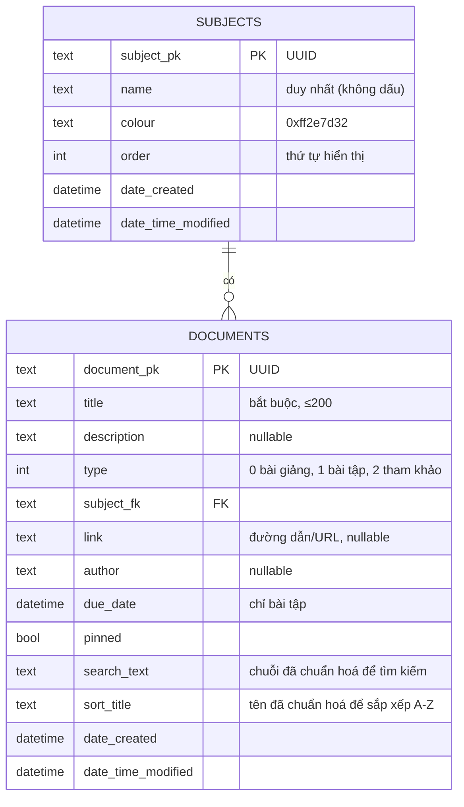
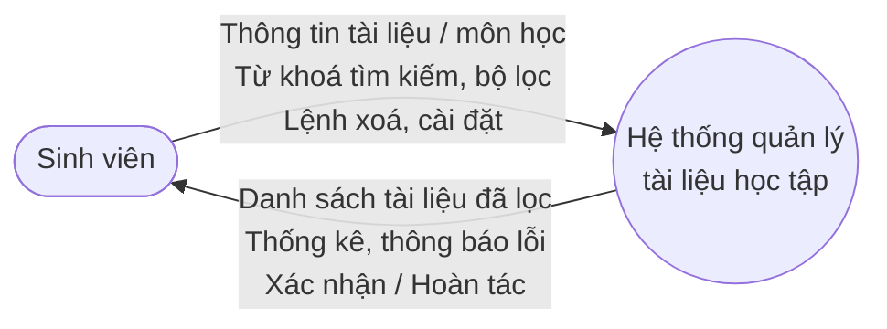
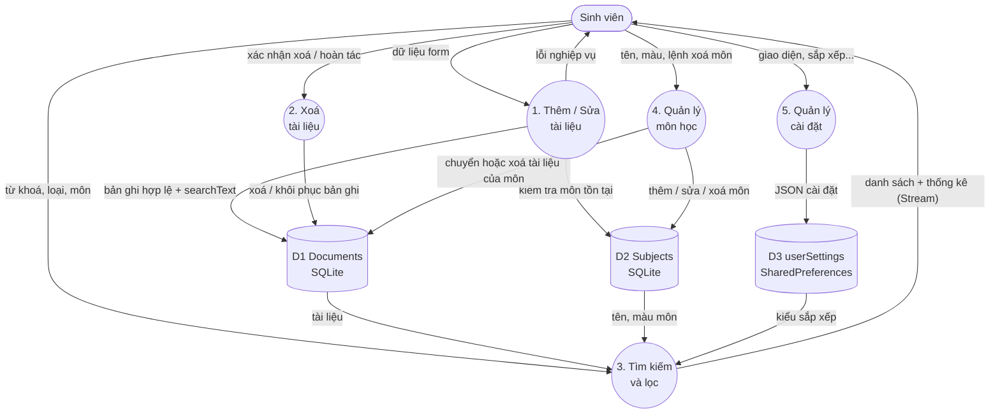
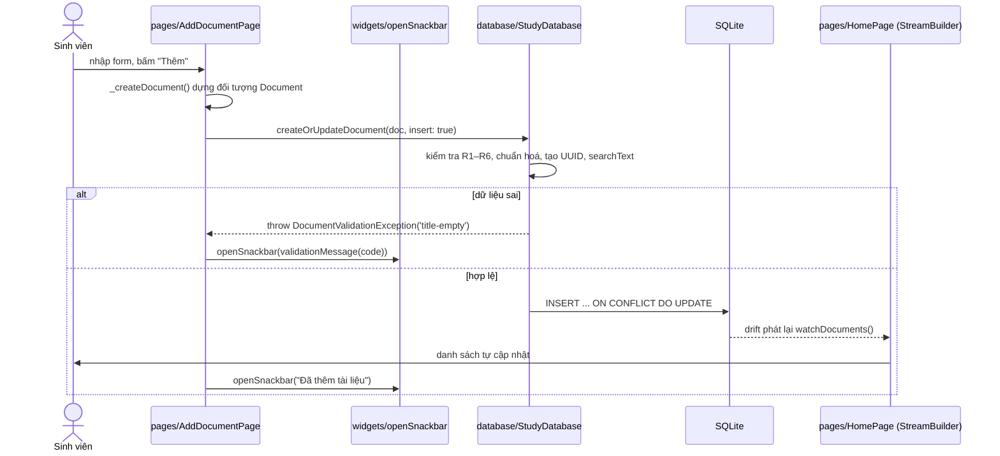
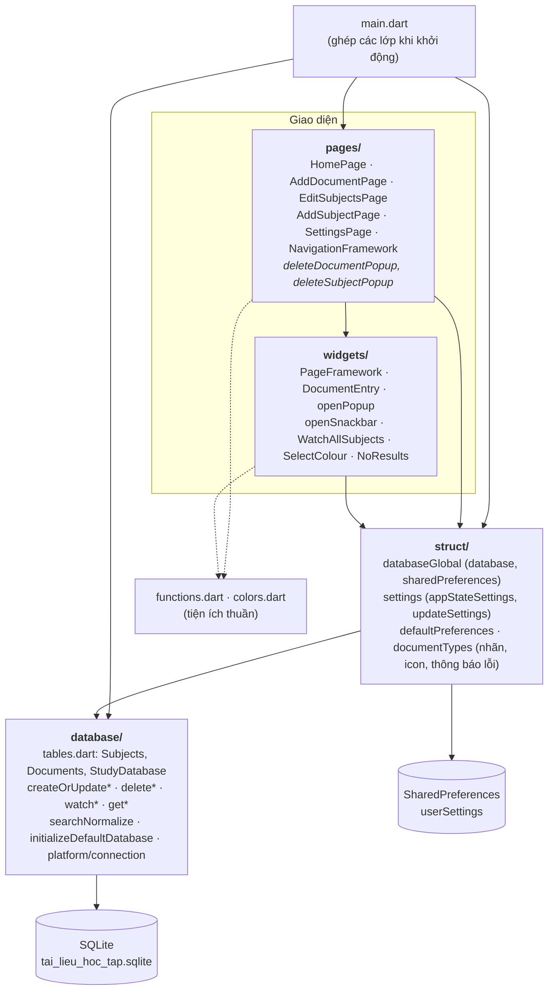

# TH1 — Báo cáo: Ứng dụng Quản lý Tài liệu Học tập theo Kiến trúc Cashew

**Sinh viên:** Nguyễn Hải Ninh – MSSV 2351170609 – Đại học Thủy Lợi
**Môn:** Lập trình di động
**Mã nguồn:** thư mục `TH1/` (project Flutter `quan_ly_tai_lieu`)
**Công nghệ:** Flutter 3.47 · Dart 3.13 · drift 2.35 (SQLite) · shared_preferences · provider

---

## 📌 Tóm tắt

Ứng dụng giúp sinh viên lưu trữ và tra cứu **tài liệu học tập** gồm *bài giảng*, *bài tập* và *tài liệu tham khảo*, được nhóm theo **môn học**. Ứng dụng làm đủ bốn chức năng cốt lõi **Thêm – Sửa – Xoá – Tìm kiếm**, ngoài ra có lọc, ghim, hạn nộp, thống kê và cài đặt giao diện.

Mã nguồn được tổ chức **giống hệt cách tổ chức của Cashew** (ứng dụng quản lý chi tiêu mã nguồn mở viết bằng Flutter, đã nghiên cứu ở bài 5 — `bai5-gr10/budget/lib`). Cụ thể là bốn lớp `database/ → struct/ → widgets/ → pages/` cùng hai file tiện ích `functions.dart`, `colors.dart`. Việc phân tách lớp được **kiểm thử tự động**: một bộ test đọc toàn bộ lệnh `import` và báo lỗi nếu lớp dưới phụ thuộc ngược lên lớp trên.

| Checklist | Mục trong báo cáo | Kết quả |
|---|---|---|
| 1. Phân tích yêu cầu, sơ đồ luồng dữ liệu | [§1](#1-phân-tích-yêu-cầu-chức-năng-và-sơ-đồ-luồng-dữ-liệu) | 10 yêu cầu chức năng, ERD, DFD mức 0 và mức 1, sơ đồ tuần tự |
| 2. Cấu trúc thư mục, phân lớp theo Cashew | [§2](#2-cấu-trúc-thư-mục-và-phân-lớp-theo-kiến-trúc-cashew) | 4 lớp + bảng đối chiếu từng file với Cashew |
| 3. Thêm, sửa, xoá, tìm kiếm | [§3](#3-triển-khai-các-chức-năng-cốt-lõi) | Đủ 4 chức năng + 6 chức năng mở rộng |
| 4. Kiểm thử phân tách logic giữa các lớp | [§4](#4-kiểm-thử) | 48/48 test pass, `flutter analyze` sạch |
| 5. Đóng gói, báo cáo | [§5](#5-đóng-gói-và-chạy-ứng-dụng) | Script `tool/dong_goi.ps1` + báo cáo này |

---

## 1. Phân tích yêu cầu chức năng và sơ đồ luồng dữ liệu

### 1.1. Tác nhân và phạm vi

- **Tác nhân:** một người dùng duy nhất — sinh viên — dùng ứng dụng trên điện thoại Android hoặc máy tính Windows.
- **Dữ liệu lưu cục bộ** (offline hoàn toàn), giống Cashew: dữ liệu nghiệp vụ nằm trong SQLite, cài đặt nằm trong SharedPreferences.

### 1.2. Yêu cầu chức năng

| Mã | Yêu cầu | Mô tả | Màn hình |
|---|---|---|---|
| **F1** | **Thêm tài liệu** | Nhập tên (bắt buộc), loại, môn học, mô tả, đường dẫn/URL, tác giả, hạn nộp (chỉ với bài tập), ghim | Thêm tài liệu |
| **F2** | **Sửa tài liệu** | Mở tài liệu từ danh sách, sửa mọi trường. Rời trang khi chưa lưu thì được hỏi lại | Sửa tài liệu (dùng chung trang với F1) |
| **F3** | **Xoá tài liệu** | Xoá sau khi xác nhận, có nút **Hoàn tác** trên snackbar | Danh sách / Sửa tài liệu |
| **F4** | **Tìm kiếm** | Tìm theo tên, mô tả, tác giả, đường dẫn. **Không phân biệt hoa/thường và dấu tiếng Việt** ("giai tich" tìm ra "Giải tích") | Danh sách |
| F5 | Lọc | Lọc theo loại (bấm thẻ thống kê) và theo môn (chip). Kết hợp được với tìm kiếm | Danh sách |
| F6 | Sắp xếp và ghim | Mới nhất / Cũ nhất / Tên A→Z / Hạn nộp gần nhất. Tài liệu ghim luôn ở đầu | Danh sách, Cài đặt |
| F7 | Quản lý môn học | Thêm/sửa/xoá môn, chọn màu. Khi xoá môn còn tài liệu: **chuyển sang môn khác** hoặc **xoá luôn** | Môn học |
| F8 | Thống kê nhanh | Số tài liệu theo từng loại, cập nhật tức thời | Danh sách |
| F9 | Hạn nộp | Bài tập hiển thị "Còn n ngày" / "Quá hạn n ngày" | Danh sách |
| F10 | Cài đặt | Giao diện sáng/tối/hệ thống, màu chủ đạo, hiện/ẩn mô tả, tạo dữ liệu mẫu, xoá toàn bộ dữ liệu | Cài đặt |

**Quy tắc nghiệp vụ** (đều nằm ở lớp `database/`, xem §3):

| Mã | Quy tắc |
|---|---|
| R1 | Tên tài liệu bắt buộc, tối đa 200 ký tự, tự cắt khoảng trắng đầu/cuối |
| R2 | Tài liệu phải thuộc một môn học đang tồn tại (khoá ngoại + kiểm tra trước khi lưu) |
| R3 | Nếu đường dẫn có dạng URL (`...://...`) thì phải có tên miền hợp lệ |
| R4 | Chỉ *bài tập* mới giữ hạn nộp; đổi sang loại khác thì hạn nộp bị xoá |
| R5 | Tên môn học không được trùng (so sánh không dấu, không phân biệt hoa/thường) |
| R6 | Trường văn bản rỗng được lưu là `NULL` |

**Yêu cầu phi chức năng:** chạy offline; danh sách tự cập nhật khi dữ liệu đổi; giao diện tiếng Việt; dễ mở rộng thêm thực thể mới (xem §6).

### 1.3. Mô hình dữ liệu



Thiết kế giữ các quy ước của Cashew: khoá chính là **chuỗi UUID** (`clientDefault(() => uuid.v4())`), enum lưu bằng `intEnum<...>()`, có cột `dateCreated` / `dateTimeModified`, và có cột `order` cho môn học (giống `Wallets`, `Categories` của Cashew).

### 1.4. Sơ đồ luồng dữ liệu (DFD)

**DFD mức 0 (sơ đồ ngữ cảnh):**



**DFD mức 1:**



**Sơ đồ tuần tự — Thêm tài liệu** (cho thấy dữ liệu đi qua từng lớp):



Điểm mấu chốt — cũng là đặc trưng của Cashew: **trang thêm tài liệu không hề gọi "làm mới danh sách"**. Lớp database ghi xong thì drift tự phát lại mọi `Stream` đang theo dõi bảng đó, nên trang danh sách và phần thống kê tự vẽ lại.

---

## 2. Cấu trúc thư mục và phân lớp theo kiến trúc Cashew

### 2.1. Kiến trúc Cashew

Từ mã nguồn Cashew (`bai5-gr10/budget/lib`) rút ra các đặc điểm kiến trúc sau, và TH1 áp dụng lại toàn bộ:

| # | Đặc điểm của Cashew | Vị trí trong Cashew | Áp dụng trong TH1 |
|---|---|---|---|
| 1 | Toàn bộ bảng + truy vấn + quy tắc dữ liệu tập trung trong **một lớp database drift** | `database/tables.dart` → `FinanceDatabase` | `database/tables.dart` → `StudyDatabase` |
| 2 | Hàm ghi dữ liệu theo mẫu **`createOrUpdateX(obj, insert:)`**: một hàm dùng cho cả thêm và sửa, kiểm tra hợp lệ ngay bên trong | `createOrUpdateTransaction`, `createOrUpdateWallet` | `createOrUpdateDocument`, `createOrUpdateSubject` |
| 3 | Đọc dữ liệu bằng **Stream `watchX()`**; giao diện dùng `StreamBuilder` nên tự cập nhật | `watchAllTransactions`, `watchAllCategories` | `watchDocuments`, `watchAllSubjectsWithCount`, `watchCountByType` |
| 4 | Điều kiện lọc là các **`Expression<bool>` tái sử dụng**, ghép bằng `&` | `onlyShowTransactionBasedOnSearchQuery`... | `onlyShowBasedOnSearchQuery`, `onlyShowBasedOnTypes`, `onlyShowBasedOnSubjects` |
| 5 | Lớp "view" ghép bảng | `TransactionWithCategory` | `DocumentWithSubject`, `SubjectWithCount` |
| 6 | Kết nối CSDL tách riêng theo nền tảng | `database/platform/native.dart` | `database/platform/connection.dart` |
| 7 | Dữ liệu mặc định khi chạy lần đầu | `database/initializeDefaultDatabase.dart` | `database/initializeDefaultDatabase.dart` |
| 8 | **Biến toàn cục** `database`, `sharedPreferences` | `struct/databaseGlobal.dart` | `struct/databaseGlobal.dart` |
| 9 | Cài đặt là một `Map` toàn cục lưu JSON, sửa qua `updateSettings(key, value, updateGlobalState:)` | `struct/settings.dart`, `struct/defaultPreferences.dart` | cùng tên file |
| 10 | Widget dùng chung: khung trang, hộp thoại, snackbar | `widgets/framework/pageFramework.dart`, `widgets/openPopup.dart` | cùng tên file |
| 11 | Provider chỉ dùng để phát luồng dữ liệu dùng chung | `widgets/watchAllWallets.dart` | `widgets/watchAllSubjects.dart` |
| 12 | **Một trang cho cả Thêm và Sửa**: truyền đối tượng vào là sửa, không truyền là thêm | `pages/addTransactionPage.dart` | `pages/addDocumentPage.dart`, `pages/addSubjectPage.dart` |
| 13 | Hàm **`deleteXPopup`** đặt cạnh trang của thực thể; `openDeletePopup` trả về `DeletePopupAction`; `RoutesToPopAfterDelete` | `deleteTransactionPopup`, `deleteCategoryPopup` | `deleteDocumentPopup`, `deleteSubjectPopup` |
| 14 | Mỗi khối của trang chủ là một file riêng | `pages/homePage/homePage*.dart` | `pages/homePage/homePageStats.dart`, `homePageFilters.dart` |
| 15 | Tiện ích và màu sắc ở gốc `lib/` | `functions.dart`, `colors.dart` | cùng tên file |
| 16 | Khởi động: SharedPreferences → database → settings → `runApp(InitializeApp(key: appStateKey))` | `main.dart` | `main.dart` |
| 17 | Quy ước đặt tên: file camelCase, hằng số viết hoa | `addTransactionPage.dart`, `NAME_LIMIT` | giữ nguyên (đã tắt 2 lint tương ứng trong `analysis_options.yaml`) |

### 2.2. Sơ đồ kiến trúc phân lớp



**Quy tắc phụ thuộc** — mũi tên chỉ đi xuống, không bao giờ đi lên. Các quy tắc này được kiểm thử tự động (§4.2):

| Lớp | Được import | **Không** được import |
|---|---|---|
| `database/` | `drift`, `uuid`, `path`, `path_provider`, file trong `database/` | `package:flutter/*`, `struct/`, `widgets/`, `pages/` |
| `struct/` | `database/`, Flutter, `shared_preferences` | `widgets/`, `pages/`, `main.dart` |
| `widgets/` | `struct/`, `database/` (kiểu dữ liệu), tiện ích | `pages/`, `main.dart`, `package:drift` |
| `pages/` | mọi lớp dưới | `main.dart`, `package:drift`, câu SQL |
| `functions.dart`, `colors.dart` | chỉ Flutter/intl | mọi lớp của ứng dụng |
| `platform/connection.dart` | — | chỉ `main.dart` được dùng |

Nhờ vậy **lớp database có thể chạy mà không cần Flutter UI**: `test/database_test.dart` kiểm thử toàn bộ nghiệp vụ trên SQLite trong bộ nhớ mà không dựng một widget nào.

### 2.3. Cây thư mục

```
TH1/
├── lib/
│   ├── main.dart                         Khởi động + InitializeApp (MaterialApp)
│   ├── functions.dart                    pushRoute, popRoute, formatDate, describeDueDate
│   ├── colors.dart                       bảng màu, getLightTheme/getDarkTheme
│   ├── database/                         ── LỚP DỮ LIỆU ──
│   │   ├── tables.dart                   bảng Subjects, Documents + StudyDatabase (CRUD, tìm kiếm, stream)
│   │   ├── tables.g.dart                 mã sinh bởi drift_dev (build_runner)
│   │   ├── searchNormalize.dart          bỏ dấu tiếng Việt để tìm kiếm
│   │   ├── initializeDefaultDatabase.dart dữ liệu mẫu lần đầu
│   │   └── platform/connection.dart      mở file SQLite trên thiết bị
│   ├── struct/                           ── LỚP TRẠNG THÁI TOÀN CỤC ──
│   │   ├── databaseGlobal.dart           late database, late sharedPreferences
│   │   ├── settings.dart                 appStateSettings, initializeSettings, updateSettings
│   │   ├── defaultPreferences.dart       giá trị mặc định của cài đặt
│   │   └── documentTypes.dart            nhãn/icon/màu cho enum, dịch mã lỗi
│   ├── widgets/                          ── LỚP THÀNH PHẦN GIAO DIỆN DÙNG CHUNG ──
│   │   ├── framework/pageFramework.dart  khung trang chuẩn (SliverAppBar + PopScope)
│   │   ├── openPopup.dart                openPopup, openDeletePopup, discardChangesPopup
│   │   ├── openSnackbar.dart             snackbar toàn cục (không cần context)
│   │   ├── watchAllSubjects.dart         StreamProvider danh sách môn học
│   │   ├── documentEntry.dart            một dòng tài liệu (nhận callback)
│   │   ├── selectColour.dart, noResults.dart
│   └── pages/                            ── LỚP MÀN HÌNH ──
│       ├── navigationFramework.dart      thanh tab: Tài liệu / Môn học / Cài đặt
│       ├── homePage/homePage.dart        danh sách + tìm kiếm + lọc
│       ├── homePage/homePageStats.dart   thẻ thống kê theo loại
│       ├── homePage/homePageFilters.dart chip lọc môn học
│       ├── addDocumentPage.dart          thêm/sửa tài liệu + deleteDocumentPopup
│       ├── editSubjectsPage.dart         danh sách môn + deleteSubjectPopup
│       ├── addSubjectPage.dart           thêm/sửa môn học
│       └── settingsPage.dart             cài đặt
├── test/
│   ├── database_test.dart                kiểm thử lớp database (22 test)
│   ├── settings_test.dart                kiểm thử lớp struct + functions (9 test)
│   ├── architecture_test.dart            kiểm thử quy tắc phụ thuộc giữa các lớp (9 test)
│   ├── widgets_test.dart                 kiểm thử lớp widgets độc lập (3 test)
│   └── widget_test.dart                  kiểm thử tích hợp qua giao diện (5 test)
├── tool/dong_goi.ps1                     script đóng gói mã nguồn
├── BAO_CAO.md                            báo cáo này
└── README.md
```

### 2.4. Những điểm làm khác Cashew (và lý do)

Cashew là ứng dụng thật nên có vài chỗ "đi tắt" làm các lớp dính vào nhau. TH1 giữ tinh thần của Cashew nhưng sửa những chỗ đó để việc phân lớp **kiểm chứng được**:

| Cashew | TH1 | Lý do |
|---|---|---|
| `appStateKey` khai báo trong `main.dart`, nhưng `struct/settings.dart` lại import `main.dart` để dùng nó | `appStateKey` và mixin `RefreshableAppState` nằm trong `struct/settings.dart`; `main.dart` dùng lại chúng | Bỏ vòng phụ thuộc `struct → main` |
| `updateSettings(..., pagesNeedingRefresh: [...])` gọi `GlobalKey` của từng trang | `ValueNotifier settingsVersion`; trang nào cần thì tự lắng nghe | `struct/` không cần biết có những trang nào |
| Widget dòng giao dịch (`TransactionEntry`) import thẳng `AddTransactionPage` | `DocumentEntry` nhận `onTap`, `onDelete`, `onTogglePinned` qua callback | `widgets/` không import `pages/` → widget dùng lại được và test độc lập được |
| `navigationFramework.dart` nằm trong `widgets/` nhưng import mọi trang | Đặt trong `pages/` | Đúng chiều phụ thuộc |
| Lỗi nghiệp vụ ném ra dạng chuỗi (`throw "category-no-longer-exists"`) | `DocumentValidationException(code)`; `struct/documentTypes.dart` dịch mã lỗi thành câu tiếng Việt | Bắt lỗi có kiểu; lớp database không chứa chữ hiển thị |
| `tables.dart` lấy `uuid` từ `struct/databaseGlobal.dart` | `uuid` khai báo ngay trong `database/tables.dart` | Lớp database không phụ thuộc lớp nào |
| Cashew dùng `easy_localization` | Dùng chuỗi tiếng Việt trực tiếp + `flutter_localizations` cho widget hệ thống | Phạm vi bài tập nhỏ, chỉ một ngôn ngữ |

---

## 3. Triển khai các chức năng cốt lõi

### 3.1. Thêm và Sửa — một trang, một hàm ghi

**Giao diện** (`pages/addDocumentPage.dart`) theo đúng mẫu `AddTransactionPage` của Cashew:

```dart
class AddDocumentPage extends StatefulWidget {
  const AddDocumentPage({super.key, this.document});
  final Document? document;      // null = thêm mới, khác null = sửa
}
...
await database.createOrUpdateDocument(_createDocument(), insert: !_isEditing);
```

- Tiêu đề trang, nhãn nút ("Thêm" / "Lưu thay đổi") và nút xoá trên AppBar đổi theo `_isEditing`.
- Khi rời trang mà còn thay đổi chưa lưu → `discardChangesPopup` (dùng `PopScope` trong `PageFramework`, chặn được cả nút Back của Android).
- Trang **không tự kiểm tra hợp lệ**. Nó chỉ bắt `DocumentValidationException` rồi hiển thị: lỗi về tên thì hiện ngay dưới ô nhập, mọi lỗi đều hiện trên snackbar.

**Dữ liệu** (`database/tables.dart`) theo mẫu `createOrUpdateTransaction`:

```dart
Future<String> createOrUpdateDocument(Document document, {bool insert = false}) async {
  final title = document.title.trim();
  if (title.isEmpty) throw const DocumentValidationException('title-empty');        // R1
  if (await tryGetSubject(document.subjectFk) == null)
    throw const DocumentValidationException('subject-not-found');                 // R2
  ... kiểm tra URL (R3), hạn nộp chỉ cho bài tập (R4), rỗng -> null (R6)
  final documentPk = insert ? uuid.v4() : document.documentPk;
  ... searchText: normalizeForSearch('$title $description $author $link')
  final companion = document.copyWith(...).toCompanion(false);
  await into(documents).insertOnConflictUpdate(companion);
  return documentPk;
}
```

Cashew dùng `InsertMode.insertOrReplace`. TH1 dùng `insertOnConflictUpdate` (UPSERT), vì khi bật khoá ngoại thì `REPLACE` thực chất là *xoá rồi chèn*, có thể vi phạm ràng buộc với bản ghi con.

Khi dùng UPSERT phải gọi **`toCompanion(false)`**. Với `toCompanion(true)`, drift coi cột `null` là "không thay đổi": người dùng xoá trắng ô mô tả rồi lưu thì mô tả cũ vẫn còn. Lỗi này được phát hiện ở vòng review và có test riêng (*"sửa: xoá trắng trường tuỳ chọn và đổi loại thì giá trị cũ bị xoá thật"*). Đưa `toCompanion(true)` trở lại thì test đỏ với `Expected: null, Actual: 'Mô tả cũ'`.

### 3.2. Xoá — xác nhận, xoá, hoàn tác

```dart
Future<DeletePopupAction?> deleteDocumentPopup(BuildContext context,
    {required Document document, required RoutesToPopAfterDelete routesToPopAfterDelete}) async {
  final action = await openDeletePopup(context, title: 'Xoá tài liệu?', subtitle: document.title);
  if (action != DeletePopupAction.delete) return action;
  if (routesToPopAfterDelete == RoutesToPopAfterDelete.one && context.mounted) popRoute(context);
  await database.deleteDocument(document.documentPk);
  openSnackbar(title: 'Đã xoá tài liệu', actionLabel: 'Hoàn tác',
      onAction: () => database.createOrUpdateDocument(document));   // ghi lại bản cũ, giữ nguyên khoá
  return action;
}
```

- Dùng được ở hai nơi: biểu tượng thùng rác trên danh sách (`RoutesToPopAfterDelete.none`) và nút xoá trong trang sửa (`.one` để đóng trang sau khi xoá).
- **Xoá môn học** (`deleteSubjectPopup`): nếu môn còn tài liệu thì hỏi tiếp "Chuyển sang môn X" hay "Xoá luôn n tài liệu". Lớp database làm việc này trong **một transaction**, sau đó đánh lại số `order` của các môn — giống `deleteCategory` / `deleteWallet` của Cashew.

### 3.3. Tìm kiếm và lọc

SQLite chỉ so khớp `LIKE` không phân biệt hoa/thường với ký tự ASCII, nên "giải tích" và "GIẢI TÍCH" sẽ không khớp nhau. Lời giải đặt ở lớp database:

1. Mỗi lần ghi, `createOrUpdateDocument` tính sẵn cột `searchText = normalizeForSearch(tên + mô tả + tác giả + đường dẫn)`. Hàm này chuyển chữ thường, bỏ dấu (gồm cả `đ → d`) và gộp khoảng trắng.
2. Khi tìm, từ khoá cũng được chuẩn hoá rồi so bằng `instr(search_text, từ_khoá) > 0`. Dùng `instr` thay cho `LIKE` để ký tự `%` và `_` người dùng gõ không bị hiểu là ký tự đại diện.
3. Sắp xếp A→Z dùng cột `sortTitle` (tên đã chuẩn hoá), nên "Đề cương" đứng cạnh "Đề cương ôn tập" chứ không bị đẩy ra sau "Drift".

Các điều kiện được ghép từ những biểu thức tái sử dụng, giống Cashew:

```dart
select(documents).join([innerJoin(subjects, subjects.subjectPk.equalsExp(documents.subjectFk))])
  ..where(onlyShowBasedOnSearchQuery(searchFor) &
          onlyShowBasedOnTypes(types) &
          onlyShowBasedOnSubjects(subjectFks))
  ..orderBy([OrderingTerm.desc(documents.pinned), sortTerm, ...]);
```

Phía giao diện, `HomePage` chỉ giữ trạng thái `_searchValue`, `_selectedTypes`, `_selectedSubjects` và tạo lại `Stream` khi một trong các giá trị này đổi (có so khoá để không đăng ký lại stream ở mỗi lần build).

### 3.4. Chức năng mở rộng

| Chức năng | Lớp database | Lớp struct / widgets / pages |
|---|---|---|
| Ghim | cột `pinned`, `togglePinned()`, luôn xếp đầu | nút ghim trên `DocumentEntry` |
| Hạn nộp | cột `dueDate`, quy tắc R4, sắp xếp `NULLS LAST` | `describeDueDate()` trong `functions.dart`, nhãn đỏ khi quá hạn |
| Thống kê | `watchCountByType()` dùng `GROUP BY` | `homePageStats.dart`; bấm thẻ để lọc |
| Môn học | `watchAllSubjectsWithCount()` dùng `LEFT JOIN` + `COUNT` | `WatchAllSubjects` (Provider) dùng cho chip lọc và ô chọn môn |
| Cài đặt | — | `updateSettings('theme', ..., updateGlobalState: true)` dựng lại `MaterialApp` |
| Dữ liệu mẫu | `initializeDefaultDatabase()` | chạy một lần, đánh dấu bằng khoá `hasInitializedDefaults` |

---

## 4. Kiểm thử

### 4.1. Chiến lược: mỗi lớp được kiểm thử riêng

| File | Lớp được kiểm thử | Số test | Cách cô lập |
|---|---|---|---|
| `test/database_test.dart` | `database/` | 22 | SQLite trong bộ nhớ (`NativeDatabase.memory()`), **không dựng widget nào** |
| `test/settings_test.dart` | `struct/`, `functions.dart` | 9 | `SharedPreferences.setMockInitialValues`, không có CSDL |
| `test/widgets_test.dart` | `widgets/` | 3 | Dữ liệu giả + callback đếm số lần gọi, **không có CSDL** |
| `test/architecture_test.dart` | Quy tắc phân lớp | 9 | Phân tích tĩnh mọi lệnh `import` trong `lib/` |
| `test/widget_test.dart` | Tích hợp `pages → widgets → struct → database` | 5 | Toàn bộ ứng dụng trên CSDL bộ nhớ |
| **Tổng** | | **48** | |

Việc `database_test.dart` chạy được mà không cần widget, và `widgets_test.dart` chạy được mà không cần CSDL, tự nó đã chứng minh các lớp **thật sự tách rời nhau**.

### 4.2. Kiểm thử tính đúng đắn của việc phân tách lớp

`test/architecture_test.dart` đọc mọi file `.dart` trong `lib/` (trừ file sinh mã), trích các lệnh `import`/`export` (kể cả import có điều kiện), đổi đường dẫn thành tên lớp rồi khẳng định:

1. Đọc được file của đủ 4 lớp (để test không "pass" vì không đọc được gì). Tên package được đọc từ `pubspec.yaml`.
2. Thư mục gốc `lib/` chỉ có `main.dart`, `functions.dart`, `colors.dart`, nên không thể "đi vòng" qua một file gốc lạ.
3. `database/` không import lớp nào khác và không import `package:flutter/`.
4. `struct/` chỉ import `database/`.
5. `widgets/` không import `pages/` hay `main.dart`.
6. `functions.dart`, `colors.dart` không import lớp nào của ứng dụng.
7. Không file nào import ngược `main.dart`.
8. `pages/`, `widgets/` không import `package:drift`, không gọi thẳng `database.select/delete/customStatement/...` và không chứa câu SQL (không phân biệt hoa thường), tức là **giao diện không tự viết truy vấn**.
9. Chỉ `main.dart` được dùng `platform/connection.dart` (mở file CSDL thật), nên test có thể thay bằng CSDL bộ nhớ.

Mọi cạnh import đều đi xuống và gốc `lib/` không có file trung gian, nên phụ thuộc gián tiếp cũng không thể đi ngược lên.

**Thử phá quy tắc để chứng minh test có tác dụng.**

*Lần 1:* thêm tạm dòng `import '../pages/homePage/homePage.dart';` vào `lib/widgets/noResults.dart`:

```
$ flutter test test/architecture_test.dart
00:00 +4 -1: widgets/ không import pages/ hay main.dart [E]
  Expected: empty
    Actual: ['widgets\\noResults.dart -> ../pages/homePage/homePage.dart']
00:00 +8 -1: Some tests failed.
```

*Lần 2:* trong `settingsPage.dart`, thay `database.deleteEverything()` bằng `database.customStatement('delete from documents')`. Lời gọi này không cần import drift:

```
00:00 +7 -1: giao diện (pages/, widgets/) không tự viết truy vấn SQL/drift [E]
  Expected: empty
    Actual: ['pages\\settingsPage.dart']
```

Hoàn tác thay đổi thì test xanh trở lại.

### 4.3. Các kịch bản chính được kiểm thử

| Nhóm | Kịch bản |
|---|---|
| Thêm | sinh UUID mới; cắt khoảng trắng; trường rỗng thành `NULL`; từ chối tên rỗng / môn không tồn tại / URL sai; chỉ bài tập giữ hạn nộp |
| Sửa | giữ nguyên khoá chính và ngày tạo; đổi môn học; **xoá trắng trường tuỳ chọn và đổi loại thì giá trị cũ bị xoá thật** |
| Xoá | xoá một, xoá nhiều; ghim đưa lên đầu; xoá rồi **hoàn tác** qua giao diện |
| Tìm kiếm | không dấu khớp có dấu ("GIAI TICH" → "Giải tích"); tìm theo tác giả/mô tả/URL; `%` và `_` là ký tự thường; kết hợp tìm kiếm + loại + môn; sắp xếp A→Z theo tên; **stream phát lại khi dữ liệu đổi** |
| Môn học | chặn tên trùng (không dấu); đếm tài liệu theo môn; xoá môn kèm chuyển hoặc xoá tài liệu; khoá ngoại thật sự được bật |
| Cài đặt | mặc định lần đầu; bổ sung khoá mới cho dữ liệu cũ; JSON hỏng thì quay về mặc định; lưu bền vững |
| Giao diện | luồng Thêm → Tìm → Sửa → Xoá → Hoàn tác; lỗi từ database hiện trên form; Back khi chưa nhập thì không hỏi, đã nhập thì hỏi ("Ở lại" / "Bỏ thay đổi"); xoá môn và chuyển tài liệu; chưa có môn thì hướng dẫn tạo môn |

### 4.4. Kết quả

```
$ flutter analyze
No issues found!

$ flutter test
00:08 +48: All tests passed!
```

---

## 5. Đóng gói và chạy ứng dụng

### 5.1. Chạy từ mã nguồn

```bash
cd TH1
flutter pub get
flutter test                      # 48 test
flutter run -d windows            # hoặc: flutter run (thiết bị Android)
```

- Mã sinh `lib/database/tables.g.dart` đã có sẵn. Chỉ khi sửa bảng mới cần chạy `dart run build_runner build` (giống quy trình "Migrate Database" trong README của Cashew).
- **Windows:** Flutter yêu cầu bật *Developer Mode* (`start ms-settings:developers`) để tạo symlink cho plugin trước khi `flutter run -d windows` / `flutter build windows`.
- SQLite được gói tự động qua build hook của gói `sqlite3` 3.x, không cần cài thêm `sqlite3_flutter_libs` như Cashew.

### 5.2. Đóng gói

```powershell
cd TH1
powershell -ExecutionPolicy Bypass -File tool\dong_goi.ps1
# -> tạo ..\TH1_QuanLyTaiLieu_NguyenHaiNinh.zip (chỉ mã nguồn, bỏ build/, .dart_tool/...)
```

Bản build để cài:

```bash
flutter build apk --release       # build/app/outputs/flutter-apk/app-release.apk
flutter build windows --release   # build/windows/x64/runner/Release/
```

---

## 6. Khả năng mở rộng

Ví dụ muốn thêm thực thể **"Nhãn" (Tags)** cho tài liệu, các bước đi đúng theo từng lớp và không phải sửa lớp không liên quan:

1. **database/**: thêm bảng `Tags`, `DocumentTags` vào `@DriftDatabase(tables: [...])`, tăng `schemaVersionGlobal`, viết `onUpgrade`, thêm `createOrUpdateTag`, `watchAllTags`, `onlyShowBasedOnTags(...)`; chạy `build_runner`.
2. **struct/**: thêm mã lỗi mới vào `validationMessage`; nếu có cài đặt mới thì thêm khoá vào `defaultPreferences.dart`.
3. **widgets/**: `SelectTags` dùng chung, chỉ nhận danh sách và callback.
4. **pages/**: `EditTagsPage`, `AddTagPage` + `deleteTagPopup`; thêm chip lọc vào `homePage/`.
5. **test/**: thêm test cho `database/`. `architecture_test.dart` tự áp dụng cho file mới mà không cần sửa.

---

## 7. Hạn chế và hướng phát triển

- Chưa mở trực tiếp tệp/URL. Có thể thêm `url_launcher` / `open_filex` ở lớp `pages/`.
- Chưa có bản web: Cashew dùng `WebDatabase` cho web. Muốn có thì thêm `database/platform/web.dart` và export có điều kiện như `platform/shared.dart` của Cashew.
- Chưa đồng bộ đám mây. Cashew dùng Firebase và bảng `DeleteLogs`; có thể bổ sung theo cùng mẫu.
- Tìm kiếm dùng `instr()` trên cột chuẩn hoá, đủ nhanh với vài nghìn tài liệu. Dữ liệu lớn hơn nên chuyển sang SQLite FTS5.
- `PageFramework` luôn chặn thao tác quay lại trên trang thêm/sửa (rồi tự quyết định có hỏi hay không), nên hiệu ứng xem trước "predictive back" của Android 14 không hiện ở các trang này.
