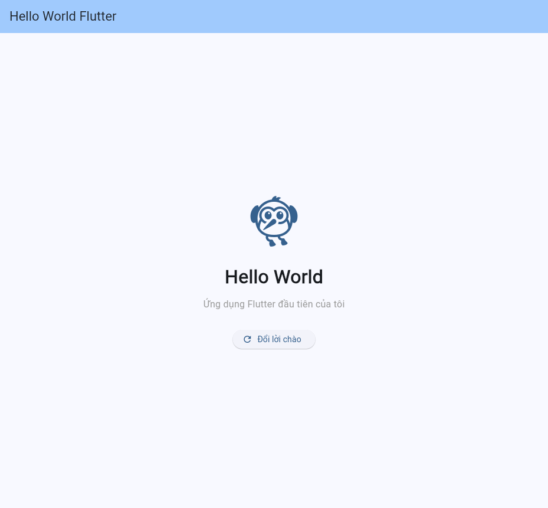

# bai2 — Ứng dụng Hello World Flutter

Ứng dụng Flutter cơ bản hiển thị dòng chữ **Hello World**, kèm một nút bấm
để đổi lời chào (minh hoạ cách quản lý trạng thái với `setState`).

## Cấu trúc mã nguồn

| Tệp | Nội dung |
|-----|----------|
| `lib/main.dart` | Toàn bộ mã nguồn ứng dụng, có comment giải thích từng phần |
| `test/widget_test.dart` | Kiểm thử giao diện (hiển thị đúng chữ, bấm nút đổi lời chào) |

Các thành phần chính trong `lib/main.dart`:

- `main()` — điểm bắt đầu của chương trình, gọi `runApp()`.
- `MyApp` (StatelessWidget) — widget gốc, cấu hình `MaterialApp`: tiêu đề, theme, màn hình chính.
- `HomePage` (StatefulWidget) — màn hình chính, có trạng thái thay đổi được.
- `_HomePageState` — chứa biến trạng thái `_viTri`, hàm `_doiLoiChao()` và phần dựng giao diện
  (`Scaffold` → `AppBar` + `Center` → `Column` → `Icon`, `Text`, `ElevatedButton`).

## Cách chạy

```bash
flutter pub get

# Chạy trên trình duyệt Chrome
flutter run -d chrome

# Hoặc chạy trên Windows / thiết bị Android đang kết nối
flutter run -d windows
flutter run -d <device-id>

# Xem danh sách thiết bị
flutter devices
```

## Kiểm tra chất lượng

```bash
flutter analyze   # Không có lỗi/cảnh báo
flutter test      # 2/2 test pass
```

## Ảnh chụp màn hình


